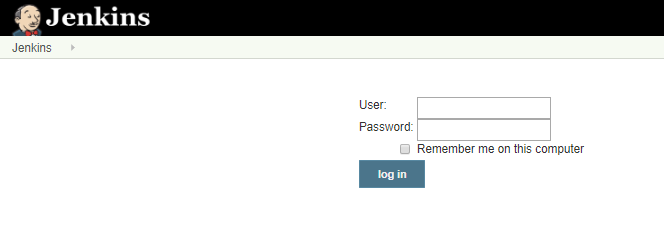

# Hands on with CI/CD with Jenkins Pipeline
## Overview

Jenkins is, fundamentally, an automation engine which supports a number of automation patterns. Pipeline adds a powerful set of automation tools onto Jenkins, supporting use cases that span from simple continuous integration to comprehensive CD pipelines. By modeling a series of related tasks, users can take advantage of the many features of Pipeline:

Code: Pipelines are implemented in code and typically checked into source control, giving teams the ability to edit, review, and iterate upon their delivery pipeline.

Durable: Pipelines can survive both planned and unplanned restarts of the Jenkins master.

Pausable: Pipelines can optionally stop and wait for human input or approval before continuing the Pipeline run.

Versatile: Pipelines support complex real-world CD requirements, including the ability to fork/join, loop, and perform work in parallel.

Extensible: The Pipeline plugin supports custom extensions to its DSL [1] and multiple options for integration with other plugins.


## Agenda

The aim of this lab is to demonstrate how to you provisining environment and application deployment in a Continuous Integration/Continuous Delivery (CI/CD) process using docker containers and Jenkins Pipeline respectively.

The tools used to create the examples for this lab are:
* **Docker** to create infrastructure for this lab
* **SonarQube** for code quality analysis to the CI/CD process.
* **Maven** to set and deploy the Java project.
* **GIT** for source code management and control
* **JFrog Artifactory** is the repository for artifact binaries and docker images.
* **Jenkins** to orchestrate the CI/CD pipeline flow.

### The infrastucture Architecture
Infra image to be added

### Pipeline flow
Now let's explore the CI/CD pipeline flow built for this lab. 


## Hands On!!
### Login to Jenkins Dashboard 
You can skip this section if you are using your own Jenkins Dashboard.


### Configure Jenkins
* ^Add your Github Credentials
* ^Add your JFrog Artifactory credentials
* ^Add Docker Server
* ^Configure Maven
* ^Add SonarQube in Conguration

### Creating the Pipeline
 
Navigate to left panel and click on **New Item**. Enter a unique job name and select Pipeline to create a pipeline job. Hit OK!


## Stage 1: Prepare environment and pull code from GitHub
Next it will take to you to job configuration page, you need to configure your job with SCM. 
* Copy your GitHub Repository link or if you are using this lab use: https://github.com/abha10/playground-pune-01.git 
* Go back to your Job and under Pipeline configuration do the following steps
  1. Definition: select *Pipeline script from SCM*
  2. SCM: Select Git
       1. Repositories URL: <Paste URL>
       2. Credentials: Select your SCM credentials
       3. Additional Behavious: ^To be added
       4. Make sure you have your Script Path as Jenkinsfile
       5. Save all the changes
 
  3. Build your job
  
## Stage 2: Build your code through Pipeline
* Add the following code to your Jenkinsfile
```
stage('Build') {
        withMaven(maven: 'Maven 3') {
            dir('app') {
                sh 'mvn clean package'
                dockerCmd 'build --tag ecsdigital-docker-snapshot-images.jfrog.io/sparktodo:SNAPSHOT .'
            }
        }
  }
```
 ## Stage 3: Deploy snapshot image to test environment
 * Add following code to your Jenkinsfile
 ```
stage('Deploy @ Test Envirnoment') {
        dir('app') {
               dockerCmd 'run -d -p 9999:9999 --name "snapshot" --network="host" ecsdigital-docker-snapshot-images.jfrog.io/sparktodo:SNAPSHOT'
         }
    }
 ```
 ## Stage 4: Perform Tests
 * Add following code to your Jenkinsfile
 ```
        try {
            dir('tests/rest-assured') {
		    
                sh 'chmod a+rwx gradlew'
                sh './gradlew clean test'
            }
        } finally {
            junit testResults: 'tests/rest-assured/build/*.xml', allowEmptyResults: true
            archiveArtifacts 'tests/rest-assured/build/**'
        }

        dockerCmd 'rm -f snapshot'
        dockerCmd 'run -d -p 9999:9999 --name "snapshot" --network="host" ecsdigital-docker-snapshot-images.jfrog.io/sparktodo:SNAPSHOT'

        try {
            withMaven(maven: 'Maven 3') {
                dir('tests/bobcat') {
                    sh 'mvn clean test -Dmaven.test.failure.ignore=true'
                }
            }
        } finally {
            junit testResults: 'tests/bobcat/target/*.xml', allowEmptyResults: true
            archiveArtifacts 'tests/bobcat/target/**'
        }

       dockerCmd 'rm -f snapshot'
        dockerCmd 'stop zalenium'
        dockerCmd 'rm zalenium'
 ```
 ## Stage 5: Push snapshot artifacts and images to JFrog artifactory
 
 * Add following code to your Jenkinsfile
 ```
 stage('Push Snapshots to Artifactory'){
       // Create an Artifactory server instance:
       def server = Artifactory.server('abhaya-docker-artifactory')
       def uploadSpec = """{
	"files": [
		{
		"pattern": "**/*.jar",
		"target": "ext-snapshot-local/"
		}
	]
	}"""
	server.upload(uploadSpec)
	   
	   
       // Create an Artifactory Docker instance. The instance stores the Artifactory credentials and the Docker daemon host address:
       def rtDocker = Artifactory.docker server: server, host: "tcp://<docker server>:2375"
       
       // Push a docker image to Artifactory (here we're pushing hello-world:latest). The push method also expects
       // Artifactory repository name (<target-artifactory-repository>).
       def buildInfo = rtDocker.push 'ecsdigital-docker-snapshot-images.jfrog.io/sparktodo:SNAPSHOT', 'docker-snapshot-images'

       //Publish the build-info to Artifactory:
       server.publishBuildInfo buildInfo
     
        //  dockerCmd 'login -u admin -p <pwf> abhaya-docker-local.jfrog.io'
        //dockerCmd 'push abhaya-docker-local.jfrog.io/sparktodo:SNAPSHOT'
		
		
    }

 ```
 


